# LINE Chat

A LINE-style web chatting app built with **PHP** and **SQLite** (MySQL/cPanel optional). Friends, private chat, group chat, timeline/forums, and WebRTC voice calls.

**Repo:** [https://github.com/jindeli71-maker/chatting](https://github.com/jindeli71-maker/chatting)

---

## Screenshots

### Device select
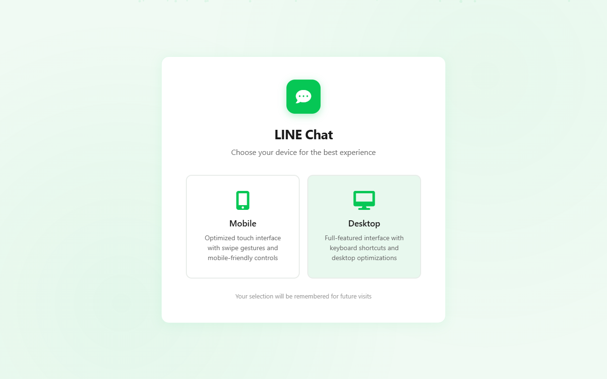

### Login
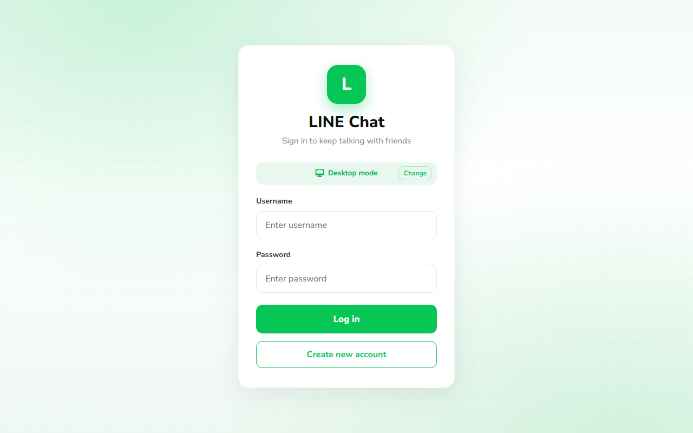

### Register
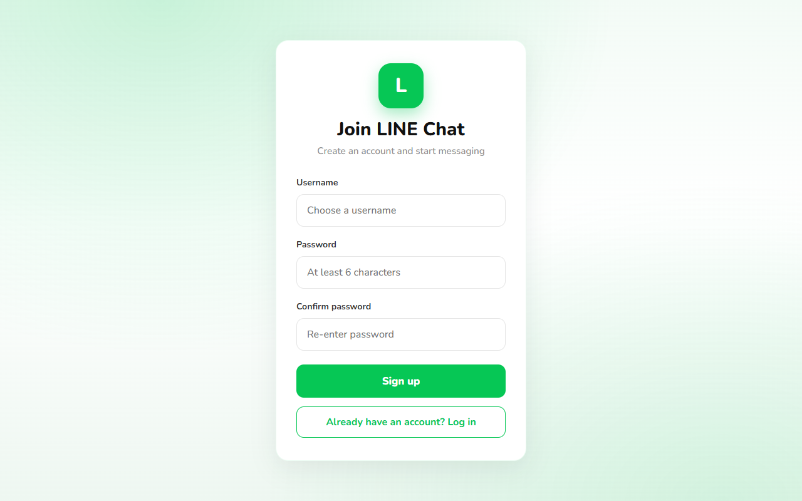

### Chats list
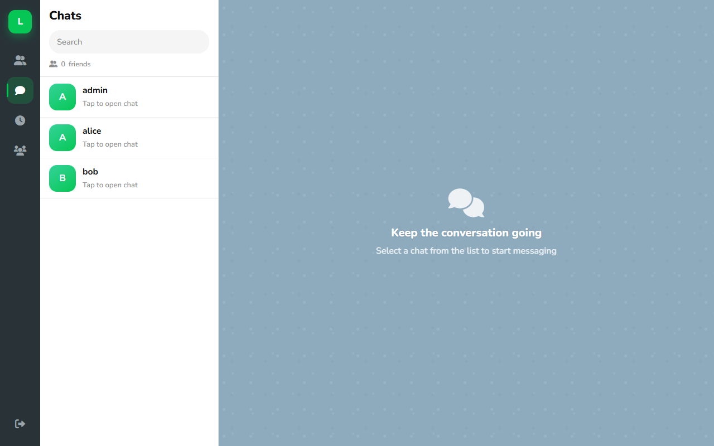

### Private chat
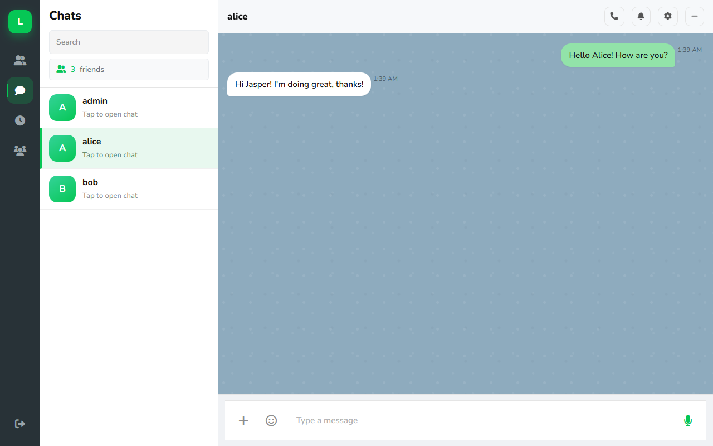

### Friends
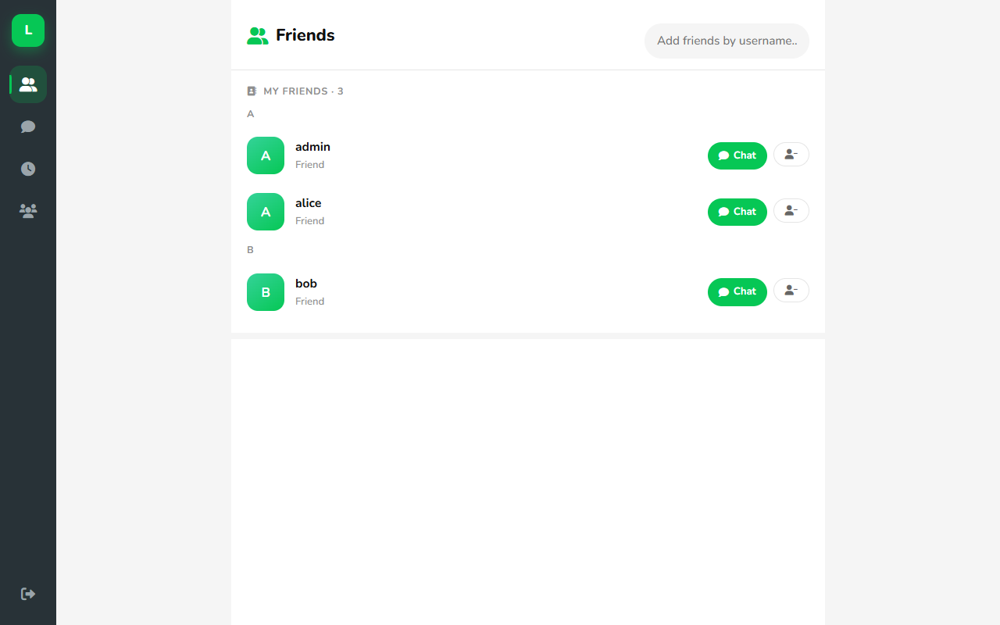

### Timeline
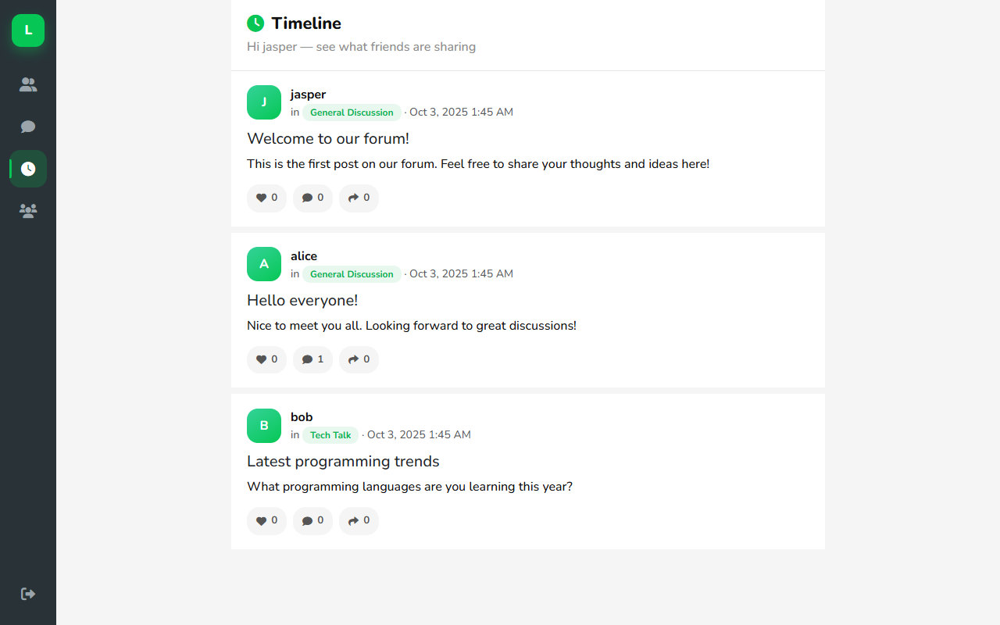

### Groups
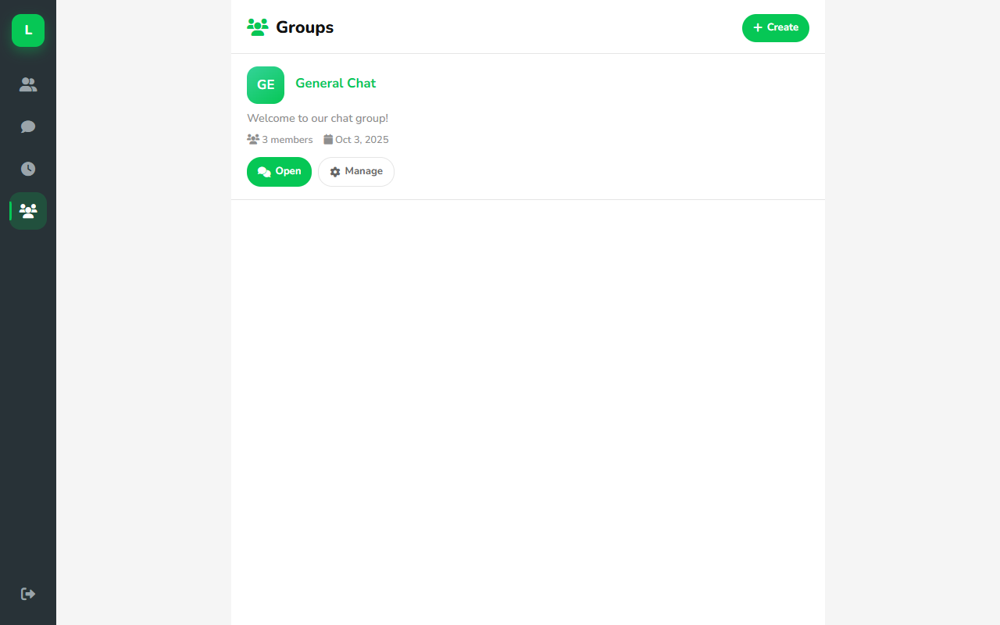

### Group chat
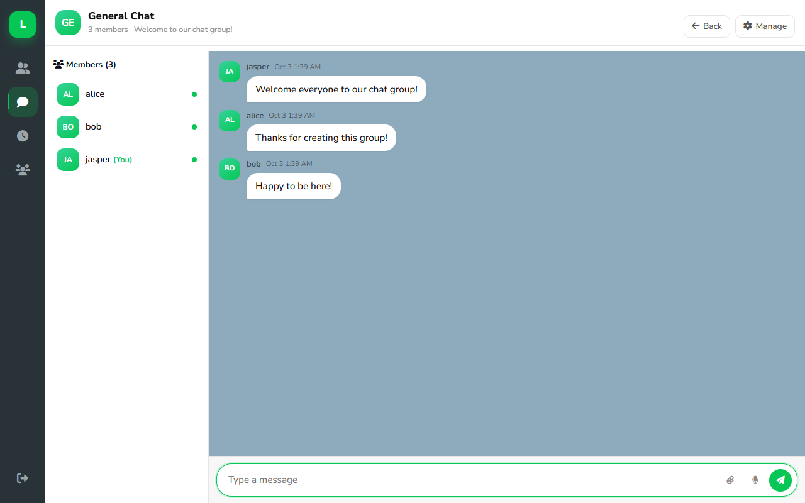

### Group manage
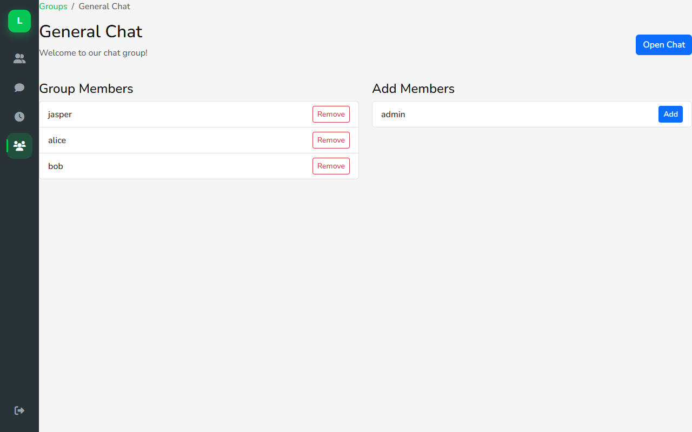

### Forums
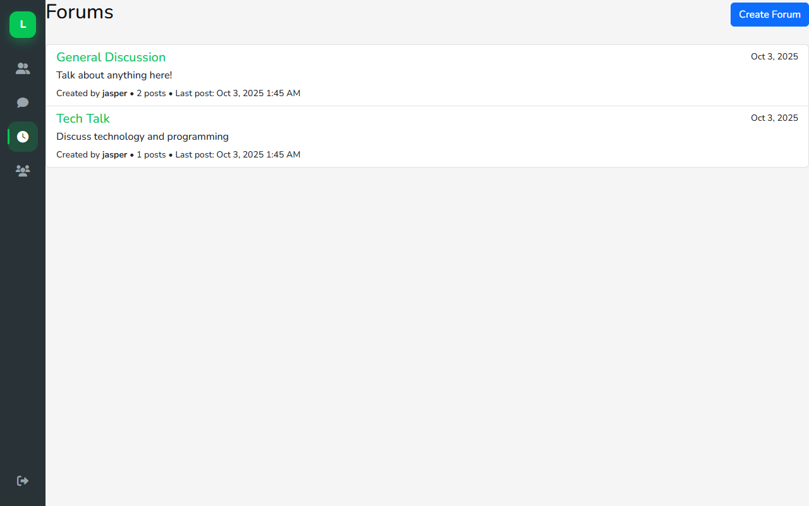

### Forum posts
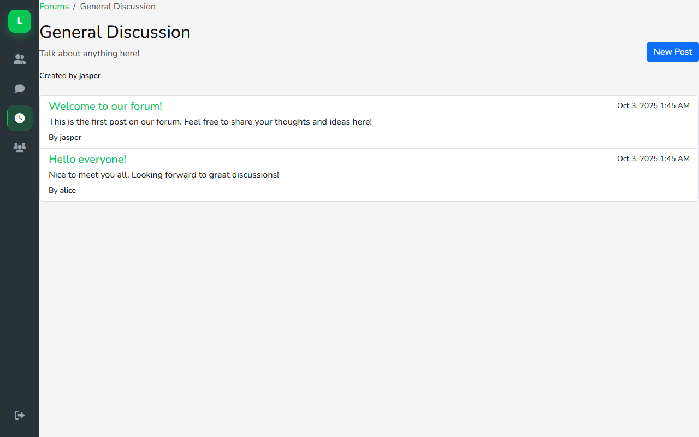

### Forum post
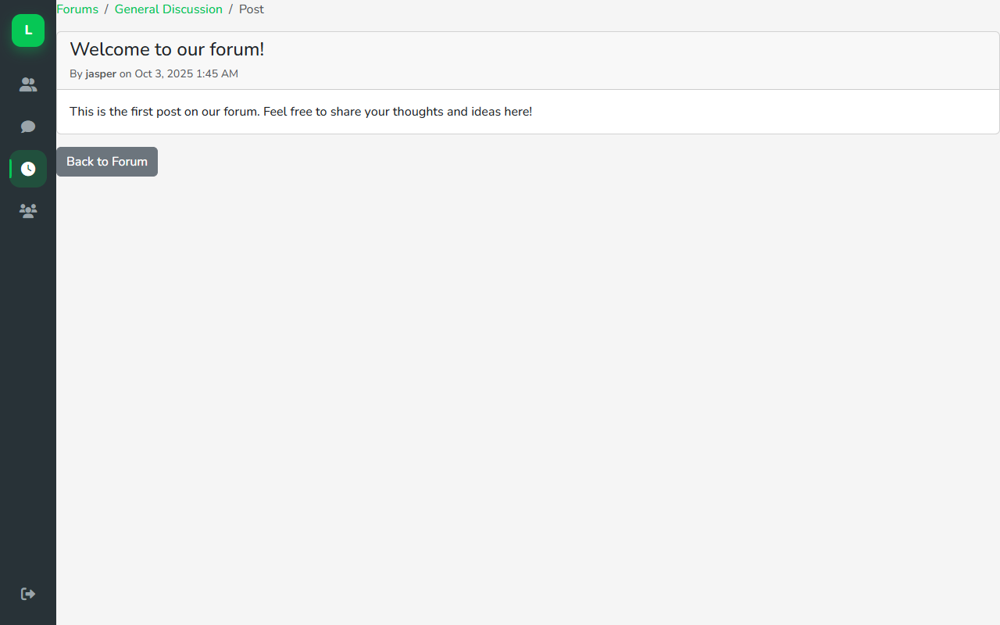

---

## Features

- **Auth** — register, login, logout (hashed passwords)
- **Friends** — search, send/accept requests
- **Private chat** — LINE-style bubbles, polling, emoji, reactions, profanity filter
- **Voice calls** — WebRTC + PHP signaling (needs HTTPS or localhost + mic permission)
- **Groups** — create groups, chat, manage members
- **Timeline / forums** — posts, likes, comments
- **Device mode** — desktop or mobile layout choice

---

## Quick start (XAMPP + SQLite)

1. Copy this project into `htdocs` (e.g. `C:\xampp\htdocs\Chatting`).
2. Start **Apache** in XAMPP.
3. Keep `USE_SQLITE = true` in `includes/config.php` (default).
4. Open:

```text
http://localhost/Chatting/device_select.php
```

Sample login (local demo DB):

| Username | Password |
|----------|----------|
| jasper   | password |
| alice    | password |

---

## cPanel / MySQL

1. Import `cpanel_mysql.sql` in phpMyAdmin.
2. In `includes/config.php`:
   - set `USE_SQLITE = false`
   - fill `DB_HOST`, `DB_NAME`, `DB_USER`, `DB_PASS`
3. Upload the PHP files (no need to upload `chatting.db` if using MySQL).

For SQLite on the server instead: upload `database/chatting.db` and keep `USE_SQLITE = true`.

---

## Main pages

| Page | File |
|------|------|
| Device select | `device_select.php` |
| Login / Register | `login.php`, `register.php` |
| Chats | `chat.php` |
| Friends | `friends.php` |
| Timeline | `index.php` |
| Groups | `groups.php`, `group_chat.php`, `group_manage.php` |
| Forums | `forums.php`, `forum_posts.php`, `forum_post.php` |

---

## Project layout

```text
Chatting/
├── assets/css/line-style.css
├── assets/js/
├── database/chatting.db      # SQLite data (local)
├── docs/screenshots/         # README screenshots
├── includes/config.php       # SQLite / MySQL switch
├── chat.php / chat_api.php
├── voice_call_api.php
└── cpanel_mysql.sql
```

---

## Notes

- Real-time chat uses polling (not WebSockets).
- Voice calls need both users on each other’s chat page, plus mic access.
- Before a public deploy, remove or lock debug helpers (`view_db.php`, `quick_login.php`, test scripts).
- `database/.htaccess` blocks direct download of the SQLite file when using Apache.
